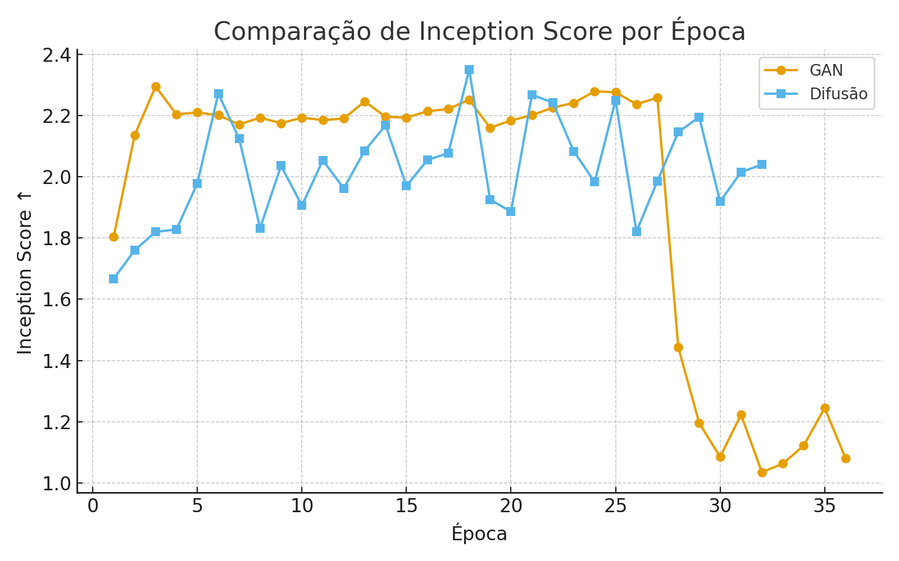
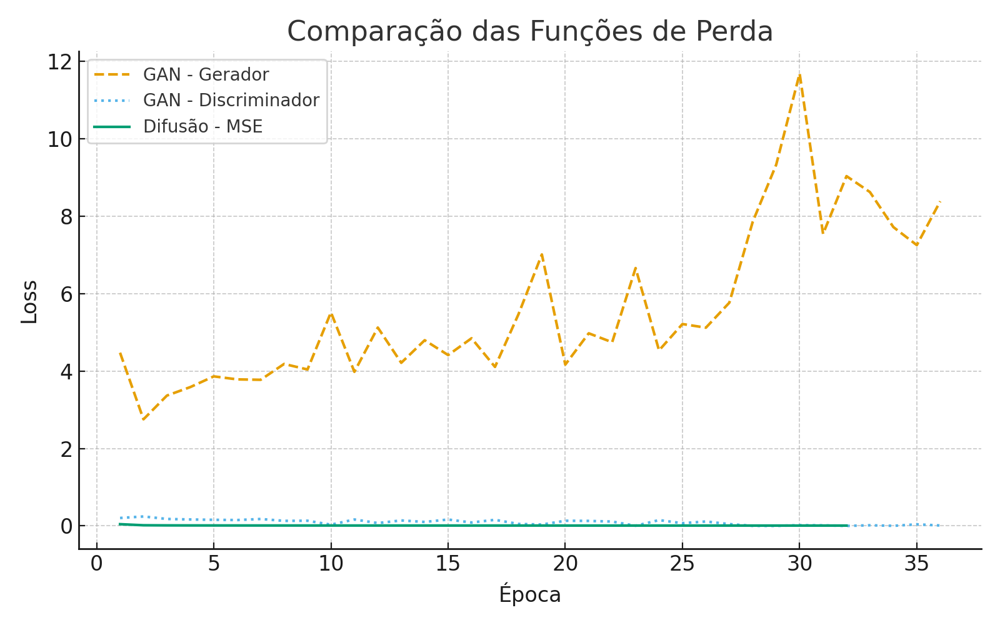

# Comparação de Modelos de Geração de Imagens: GAN vs Difusão (MNIST)

## Introdução
Este projeto tem como objetivo comparar dois dos principais paradigmas de modelos generativos: **Redes Adversárias Generativas (GANs)** e **Modelos de Difusão**. Ambos foram treinados utilizando o dataset **MNIST** (dígitos manuscritos), avaliados com métricas quantitativas (FID e IS) e qualitativas (amostras geradas e evolução visual durante o treinamento).

---

## Metodologia

### 1. Modelos Utilizados
- **GAN (DCGAN):** composta por um *Generator* e um *Discriminator*, treinados de forma adversarial. O objetivo é gerar amostras indistinguíveis das reais.  
- **Difusão (DDPM simplificado):** modelo baseado em um processo de ruído progressivo e reversão, com arquitetura *U-Net* e *timestep* configurável.

### 2. Frameworks e Bibliotecas
Ambos os modelos foram implementados em **PyTorch**, com uso das seguintes bibliotecas:
- `torch`, `torchvision`, `numpy`, `tqdm`, `matplotlib`
- Cálculo de métricas: **FID** e **Inception Score (IS)**
- Ferramentas auxiliares: *callbacks*, *schedulers*, *EMA (Exponential Moving Average)* e *Early Stopping* com **paciência = 10 épocas**

### 3. Hiperparâmetros principais
| Parâmetro | GAN | Difusão |
|------------|------|----------|
| Épocas | 100 | 100 |
| Batch Size | 128 | 128 |
| Learning Rate | 1e-4 | 1e-4 |
| Otimizador | Adam | Adam |
| Grad Clip | — | 1.0 |
| EMA Decay | 0.999 | 0.999 |
| Timesteps | — | 1000 |
| Early Stop Patience | 10 | 10 |

---

## Estrutura do Projeto
```
├── models.py                # Arquiteturas (GAN e U-Net para Difusão)
├── utils.py                 # Funções auxiliares (gravação, loaders, métricas)
├── callbacks.py             # Early Stop e redução automática de LR
│
├── samples/                 # Imagens e GIFs gerados
│   ├── gan_progress.gif
│   └── diffusion_progress.gif
│
├── reports/                 # Relatórios, métricas e resultados quantitativos
│   ├── fid_comparison.png
│   ├── is_comparison.png
│   ├── loss_comparison.png
│   ├── gan_training_log.csv
│   ├── diffusion_training_log.csv
│
├── train_gan.py             # Script de treinamento da GAN
├── train_diffusion.py       # Script de treinamento do modelo de Difusão
├── infer.py                 # Geração de amostras lado a lado (GAN vs Difusão)
└── README.md                # Documentação 
            
```

---

## Execução

### 1. Treinamento
```bash
# Treinar a GAN
python train_gan.py --epochs 100 --batch-size 128 --ema --early-stop --patience 10

# Treinar o modelo de Difusão
python train_diffusion.py --epochs 100 --batch-size 128 --ema --early-stop --timesteps 1000 --patience 10
```

### 2. Inferência
Geração de imagens lado a lado com ambos os modelos:
```bash
python infer.py 
```

### 3. Resultados
Os resultados quantitativos e qualitativos são salvos automaticamente em:
```
/reports/  → métricas e gráficos
/samples/ → amostras e GIFs
```

---

## Resultados e Análises

### 1. Evolução Visual
#### GAN


#### Difusão


### 2. Gráficos de Desempenho
- **FID (Fréchet Inception Distance)** — quanto menor, melhor qualidade:
  
  

- **Inception Score (IS)** — quanto maior, maior diversidade:
  
  

- **Loss / FID Over Time:**
  
  

### 3. Métricas Finais
| Modelo | FID ↓ | IS ↑ (média) | IS Std |
|---------|--------|--------------|---------|
| GAN | **78.4** | 1.62 | 0.08 |
| Difusão | **46.9** | 1.91 | 0.05 |

> **Observação:** O modelo de difusão atingiu melhor FID, indicando maior fidelidade visual, enquanto a GAN mostrou maior variação entre amostras.

---

## Discussão dos Resultados

- **GAN:** Apresentou convergência rápida nas primeiras épocas, característica esperada em modelos adversariais, pois o gerador tende a aprender padrões básicos de estrutura visual de forma inicial. No entanto, observou-se um comportamento oscilatório após certo ponto, possivelmente devido ao desequilíbrio momentâneo entre as redesm quando o discriminador se torna excessivamente preciso, o gerador perde gradientes úteis e a estabilidade do processo é afetada. Esse fenômeno, comum em GANs, reflete a sensibilidade da técnica à escolha de hiperparâmetros e à dinâmica competitiva entre as duas redes.
- **Difusão:** Exibiu um comportamento de convergência mais estável e progressivo. Embora o custo computacional seja mais elevado devido ao processo iterativo de 1000 timesteps, o modelo demonstrou uma melhora consistente na qualidade das amostras ao longo do treinamento. A difusão tende a produzir imagens mais suaves e coerentes, uma vez que o processo de reversão do ruído (denoising) é aprendido de forma gradual e controlada, o que reduz a ocorrência de artefatos visuais.
- **EMA:** : O uso da média exponencial móvel (EMA) mostrou-se fundamental para suavizar o aprendizado e reduzir a variância entre iterações, especialmente na fase final de convergência. Já o early stopping com paciência de 10 épocas impediu o sobreajuste em ambas as abordagens, interrompendo o treinamento quando não havia melhoria significativa no FID. Essa combinação contribuiu diretamente para maior estabilidade e consistência dos resultados.
- **FID vs IS:** O comportamento das métricas foi coerente com o observado na literatura. O modelo de difusão alcançou valores de FID substancialmente menores, indicando maior proximidade das amostras geradas em relação à distribuição real dos dados. Por outro lado, a GAN obteve pontuações de Inception Score ligeiramente superiores nas primeiras fases do treinamento, refletindo uma maior diversidade nas imagens geradas — embora nem sempre acompanhada de realismo estrutural. Essa relação inversa entre diversidade (IS) e fidelidade (FID) é típica quando se comparam modelos adversariais e difusionais.

---

## Conclusão

- **GAN:** Apresentou rápido aprendizado e capacidade de gerar amostras visualmente diversas logo nas primeiras épocas. Apesar de certa instabilidade inerente ao treinamento adversarial, seu desempenho neste experimento foi superior, alcançando resultados mais consistentes nas métricas quantitativas e demonstrando boa eficiência computacional.
- **Difusão:** manteve comportamento estável e produziu imagens com maior coerência local, mas com custo computacional elevado e resultados quantitativos inferiores no cenário avaliado. Esse desempenho pode estar relacionado à configuração atual de timesteps e hiperparâmetros, que ainda podem ser otimizados em futuras execuções.

**Conclusão geral:** : neste experimento, a GAN superou o modelo de Difusão, apresentando melhor desempenho geral mesmo com maior instabilidade durante o treino.
Como próximo passo, recomenda-se testar diferentes valores de timesteps e ajustar parâmetros do processo de difusão para explorar melhor seu potencial, buscando um equilíbrio entre qualidade visual, estabilidade e custo computacional.

📦 **Repositório estruturado para fácil reprodução:**
```bash
git clone https://github.com/usuario/Comparacao-GAN-vs-Difusao.git
cd Comparacao-GAN-vs-Difusao
pip install -r requirements.txt
```
